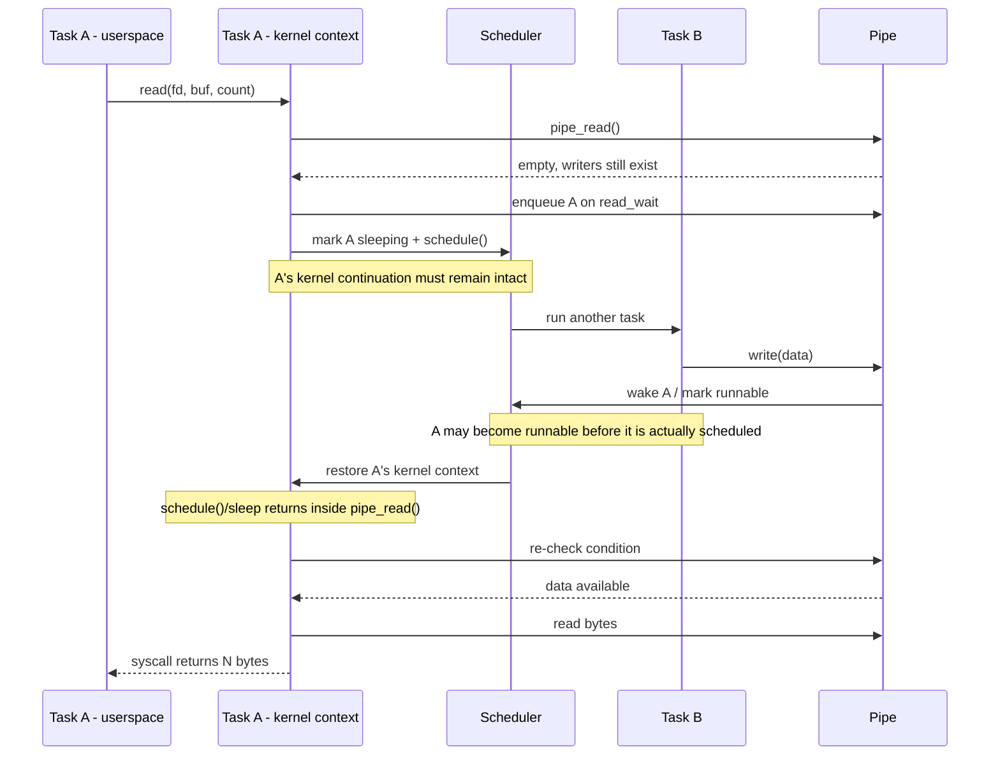

# scheduler: tasks cannot sleep inside syscalls because kernel execution contexts are not resumable

- URL: https://github.com/mentos-team/MentOS/issues/204
- Repo: mentos-team/MentOS (language: C)
- State: open; created 2026-08-19T10:39:41Z; status ok; passes main

## Issue body

reporter (MEMBER) · Galfurian · 2026-08-19T10:39:41Z · https://github.com/mentos-team/MentOS/issues/204

## Summary

MentOS currently supports switching between tasks by saving and restoring the `pt_regs_t` trap/interrupt frame associated with a transition through an interrupt, exception, or system call. This is sufficient to choose a different userspace task before returning from a trap.

However, MentOS does **not currently have a mechanism to suspend a task while that task is executing inside the kernel and later resume the same kernel execution context at the exact point where it blocked**.

This prevents true blocking system-call semantics.

The clearest concrete example is a blocking `read()` on an empty pipe. If a userspace process enters the kernel through `read()`, reaches `pipe_read()`, and the pipe contains no data while writers still exist, the correct semantic behavior is:

1. keep the `read()` system call in progress;
2. put the current task on the pipe read wait queue;
3. make the task non-runnable;
4. context-switch to another runnable task **without unwinding the current kernel call stack**;
5. when data becomes available, wake the reader;
6. later restore that reader's kernel execution context;
7. resume execution inside `pipe_read()` after the blocking point;
8. re-check the pipe condition, read the data, unwind the syscall normally, and only then return to userspace.

At the referenced snapshot, MentOS cannot do step 4/6. The current workaround is explicitly visible in `pipe_read()`: the task is marked sleeping and queued, but `pipe_read()` must still return `-EAGAIN` because the kernel execution context cannot be preserved.

Reference snapshot used throughout this issue:

- commit: `62c638a74d27b95df819e39aa242599ad798b22d`
- pipe workaround: https://github.com/mentos-team/MentOS/blob/62c638a74d27b95df819e39aa242599ad798b22d/kernel/src/fs/pipe.c#L965-L971

This is **not fundamentally a pipe bug**. Pipes are exposing a scheduler/task-model limitation that affects any kernel operation that needs to sleep and later continue in kernel mode.

---

## One-sentence problem statement

> MentOS can switch saved trap/user contexts, but it cannot save a task's in-progress kernel continuation (kernel stack + kernel CPU context), switch away, and later resume that task at the point where a blocking kernel operation slept.

Another equivalent formulation:

> MentOS lacks resumable per-task kernel execution contexts, so a task cannot sleep inside a syscall and later continue the same syscall from the point where it blocked.

This distinction is important because saying only "MentOS lacks kernel-space context switching" can be misunderstood: MentOS already invokes the scheduler while executing in ring 0. The missing capability is specifically **suspend-and-resume of an arbitrary in-progress kernel call chain**.

---

## What correct blocking semantics should mean

Consider process A executing:

```c
char buffer[128];
ssize_t n = read(pipefd[0], buffer, sizeof(buffer));
```

Assume:

- the read end is blocking (`O_NONBLOCK` is not set);
- the pipe is empty;
- at least one writer still exists.

From userspace, this must look like **one single `read()` invocation**. The process should not receive `-EAGAIN` merely because the kernel needed to deschedule it.

Conceptually:

```text
Process A - userspace

    read(fd, buffer, 128)
            |
            | system call
            v
+---------------- KERNEL ----------------+
|                                         |
|  sys_read()                             |
|      |                                  |
|      v                                  |
|  vfs_read()                             |
|      |                                  |
|      v                                  |
|  pipe_read()                            |
|      |                                  |
|      | pipe empty, writers > 0          |
|      v                                  |
|  sleep on pipe->read_wait               |
|      |                                  |
|      |   TASK A IS NOT RUNNING          |
|      |   OTHER TASKS MAY RUN            |
|      |                                  |
|      | data eventually becomes ready    |
|      v                                  |
|  resume inside pipe_read()              |
|      |                                  |
|      v                                  |
|  re-check condition                     |
|      |                                  |
|      v                                  |
|  copy available bytes                   |
|      |                                  |
|      v                                  |
|  return N                               |
|                                         |
+-----------------------------------------+
            |
            | return from syscall
            v
Process A - userspace

    n == number_of_bytes_read
```

The critical property is that **the syscall remains logically in progress while A is sleeping**.

The process is blocked, but it is not returned to userspace to perform a retry loop.

---

## Desired execution sequence



A standard kernel-style blocking loop is conceptually similar to:

```c
for (;;) {
    lock(pipe);

    if (pipe_has_data(pipe)) {
        n = consume_data(pipe, buffer, count);
        unlock(pipe);
        return n;
    }

    if (pipe_has_no_writers(pipe)) {
        unlock(pipe);
        return 0; /* EOF */
    }

    prepare_to_wait(&pipe->read_wait, current);
    unlock(pipe);

    schedule(); /* returns later, in the SAME kernel call chain */

    finish_wait(&pipe->read_wait, current);
    /* loop and re-check the condition */
}
```

The exact API does not need to look like this. The important semantic requirement is that `schedule()` (or an equivalent primitive) can switch away from the current task **from normal kernel C code** and later return to that same call site when the task runs again.

---

## What MentOS currently does instead

The current pipe path already contains a workaround for this missing capability.

Relevant code:

https://github.com/mentos-team/MentOS/blob/62c638a74d27b95df819e39aa242599ad798b22d/kernel/src/fs/pipe.c#L965-L971

Conceptually, the current code is:

```c
if (pipe_is_blocking(file)) {
    pipe_put_process_to_sleep(
        pipe_info,
        &pipe_info->read_wait,
        pipe_read_wake_function,
        "pipe_read");
}

/* Workaround because kernel execution cannot be resumed here. */
bytes_read = -EAGAIN;
```

The comment in the actual source is explicit:

```c
// TODO: We currently do not save kernel regs status, so we need a
// work-around when putting processes to sleep.
bytes_read = -EAGAIN;
```

The function called by that path eventually uses `sleep_on()`.

Current `sleep_on()` implementation:

https://github.com/mentos-team/MentOS/blob/62c638a74d27b95df819e39aa242599ad798b22d/kernel/src/process/wait.c

Its essential behavior is:

```c
wait_queue_entry_t *sleep_on(wait_queue_head_t *head)
{
    task_struct *sleeping_task = scheduler_get_current_process();

    sleeping_task->state = TASK_UNINTERRUPTIBLE;

    wait_queue_entry_t *entry = wait_queue_entry_alloc();
    wait_queue_entry_init(entry, sleeping_task);
    add_wait_queue(head, entry);

    return entry;
}
```

That function does **not** suspend the current kernel execution.

It:

1. changes the task state;
2. allocates a wait-queue entry;
3. puts the task on the queue;
4. returns normally to its caller.

Therefore `pipe_put_process_to_sleep()` also returns normally, then `pipe_read()` continues executing and must eventually return from the syscall.

So today, "sleep" means approximately:

> mark this task as sleeping so that the scheduler will not select it after the current trap/syscall unwinds.

What is required is instead:

> mark this task as sleeping, switch away **right now**, and later resume this exact kernel execution when the task becomes runnable again.

Those are fundamentally different semantics.

---

## Current flow in detail

At the referenced snapshot, a blocking pipe read behaves approximately like this:

```text
Task A userspace
    |
    | read(fd, ...)
    v
system-call entry
    |
    v
syscall_handler(pt_regs_t *f)
    |
    v
sys_read(...)
    |
    v
VFS read path
    |
    v
pipe_read(...)
    |
    | lock pipe mutex
    | no data
    v
pipe_put_process_to_sleep(...)
    |
    v
sleep_on(...)
    |
    | A.state = TASK_UNINTERRUPTIBLE
    | A added to read_wait
    v
returns to pipe_read()
    |
    | bytes_read = -EAGAIN
    | unlock pipe mutex
    v
return -EAGAIN
    |
    v
syscall_handler()
    |
    | f->eax = -EAGAIN
    v
scheduler_run(f)
    |
    | saves A's pt_regs_t
    | notices A is not runnable
    | chooses another task B
    | overwrites/restores trap frame for B
    v
iret
    |
    v
Task B userspace
```

Later a writer may wake A by changing its state back to `TASK_RUNNING`. When A is eventually selected, the scheduler restores A's saved trap/user context, and A returns to userspace from the original `read()` with `-EAGAIN`.

That can be made to work only if userspace explicitly retries, but that is not the expected semantic behavior of a blocking pipe read.

---

## Why `pt_regs_t` is not enough

The current scheduler stores/restores a `pt_regs_t`:

https://github.com/mentos-team/MentOS/blob/62c638a74d27b95df819e39aa242599ad798b22d/kernel/src/process/scheduler.c

```c
void scheduler_store_context(pt_regs_t *f, task_struct *process)
{
    process->thread.regs = *f;
}

void scheduler_restore_context(task_struct *process, pt_regs_t *f)
{
    runqueue.curr = process;
    *f = process->thread.regs;
    ...
    paging_switch_pgd(process->mm->pgd);
}
```

And the task's thread context is currently essentially:

https://github.com/mentos-team/MentOS/blob/62c638a74d27b95df819e39aa242599ad798b22d/kernel/inc/process/process.h

```c
typedef struct thread_struct {
    pt_regs_t regs;
    pt_regs_t signal_regs;
    bool_t fpu_enabled;
    savefpu fpu_register;
} thread_struct_t;
```

A trap frame answers a question like:

> What register state should be restored when this interrupt/syscall/exception returns?

For a userspace process, that includes the state required to return through `iret` to userspace.

But sleeping in the middle of `pipe_read()` requires preserving a different thing:

> What kernel instruction, kernel stack pointer, callee-saved registers, stack frames, local variables, and return-address chain are needed so that this task can continue executing `pipe_read()` from the exact point where it called `schedule()`?

For example, while A is inside the kernel, its conceptual C call stack may be:

```text
+-----------------------------------+
| syscall/trap entry frame          |
+-----------------------------------+
| syscall_handler() frame           |
+-----------------------------------+
| sys_read() frame                  |
+-----------------------------------+
| vfs_read() frame                  |
+-----------------------------------+
| pipe_read() frame                 |
+-----------------------------------+
| sleep / schedule frame            | <-- switch away here
+-----------------------------------+
              ^
              |
             ESP
```

To later continue that syscall, the kernel must preserve enough state for the CPU to return to this same stack and unwind it naturally.

Saving only the outer `pt_regs_t` trap frame does not preserve the identity of this in-progress kernel continuation.

---

## Why the current scheduler naturally switches at trap boundaries

The syscall handler is implemented in:

https://github.com/mentos-team/MentOS/blob/62c638a74d27b95df819e39aa242599ad798b22d/kernel/src/system/syscall.c

Its high-level structure is:

```c
void syscall_handler(pt_regs_t *f)
{
    switch_fpu();

    ...

    f->eax = fun(args[0], args[1], args[2], args[3], args[4]);

    scheduler_run(f);

    unswitch_fpu();
}
```

This ordering matters:

```text
enter syscall
    |
    v
execute ENTIRE syscall function
    |
    v
syscall returns to syscall_handler
    |
    v
scheduler_run(pt_regs)
    |
    v
return from trap / iret
```

So the current architecture gives the scheduler an excellent place to switch **after** a syscall has unwound back to the trap handler.

It does not provide an obvious primitive for:

```text
syscall_handler
    -> sys_read
        -> vfs_read
            -> pipe_read
                -> schedule NOW
                   ... run another task ...
                <- later continue HERE
            <- return
        <- return
    <- return
```

This is the architectural gap.

---

## Interrupt/trap-frame model

The interrupt assembly also demonstrates the trap-frame-oriented model:

https://github.com/mentos-team/MentOS/blob/62c638a74d27b95df819e39aa242599ad798b22d/kernel/src/descriptor_tables/interrupt.S

The interrupt stub saves registers onto the current kernel stack, passes `esp` to the C handler, then restores the frame and executes `iret`:

```asm
pusha
push ds
push es
push fs
push gs

push esp
call irq_handler
add esp, 4

pop gs
pop fs
pop es
pop ds
popa

add esp, 8
iret
```

That is a natural mechanism for changing the context that will be returned to by `iret`.

It is not, by itself, a general `switch_to()` primitive for preserving and restoring arbitrary kernel call stacks.

---

## Kernel stack ownership appears to be part of the missing design

A conventional way to support sleeping inside the kernel is for every task to own a kernel stack (or an equivalent private kernel continuation). Then a context switch can save the old task's kernel stack pointer and switch to the new task's kernel stack pointer.

At the referenced snapshot:

- `task_struct` / `thread_struct` store `pt_regs_t` and FPU state, but do not expose an obvious per-task saved kernel `esp`, kernel stack base/top, or low-level kernel switch context;
- the TSS implementation uses one static `kernel_tss`;
- `scheduler_enter_user_jmp()` calls:

```c
tss_set_stack(0x10, initial_esp);
```

instead of selecting a task-owned kernel-stack top.

Relevant files:

- `task_struct`: https://github.com/mentos-team/MentOS/blob/62c638a74d27b95df819e39aa242599ad798b22d/kernel/inc/process/process.h
- scheduler: https://github.com/mentos-team/MentOS/blob/62c638a74d27b95df819e39aa242599ad798b22d/kernel/src/process/scheduler.c
- TSS: https://github.com/mentos-team/MentOS/blob/62c638a74d27b95df819e39aa242599ad798b22d/kernel/src/descriptor_tables/tss.c
- userspace transition: https://github.com/mentos-team/MentOS/blob/62c638a74d27b95df819e39aa242599ad798b22d/kernel/src/process/user.S

This issue should not assume the final implementation before the stack model is fully audited, but **per-task kernel stack ownership (or an equivalent resumable continuation mechanism) is a core architectural question that must be resolved**.

For x86 ring-3 -> ring-0 transitions, if per-task kernel stacks are introduced, the TSS `esp0` normally needs to be kept consistent with the kernel stack of the task that will return to userspace, so that the next privilege transition enters the kernel on the correct stack.

---

## This is not the same as making the kernel fully preemptive

This issue does **not** necessarily require arbitrary timer-driven kernel preemption.

There are two distinct capabilities:

### 1. Voluntary kernel scheduling / sleeping - required by this issue

Kernel code explicitly reaches a point where it cannot make progress:

```c
while (!condition)
    sleep_and_schedule();
```

The task voluntarily gives up the CPU and later resumes that kernel continuation.

This is sufficient for true blocking pipes, waits, blocking IPC, sleepable synchronization, and many device-I/O paths.

### 2. Kernel preemption - separate design problem

A timer interrupt interrupts arbitrary kernel code and forcibly switches to another task before the interrupted kernel code voluntarily reaches a scheduling point.

That requires additional rules around preemption disable counts, interrupt context, locks, reentrancy, and interrupt-frame handling.

MentOS can solve this issue with a **non-preemptive kernel that supports voluntary context switches from sleepable kernel code**. Full kernel preemption can remain a separate future feature.

This distinction should remain explicit so that the implementation scope does not explode unnecessarily.

---

## Pipe example: the current mutex makes a naive `schedule()` insertion incorrect

There is another important consequence.

`pipe_read()` currently acquires `pipe_info->mutex` before checking the pipe state:

```c
mutex_lock(&pipe_info->mutex, task->pid);
```

The write path also acquires the same pipe mutex before modifying the buffers.

Therefore a future implementation must **not** simply change this:

```c
pipe_put_process_to_sleep(...);
```

into:

```c
pipe_put_process_to_sleep(...);
schedule();
```

while still holding the pipe mutex.

Otherwise the reader could sleep while holding a lock that the writer needs in order to put data into the pipe and wake the reader:

```text
Reader A
    |
    | lock(pipe->mutex)
    | observe empty
    | sleep while still owning mutex
    v
SLEEPING

Writer B
    |
    | lock(pipe->mutex)
    v
BLOCKED / cannot acquire mutex

No writer can produce data
No reader can wake
=> deadlock
```

A correct wait design normally needs a protocol equivalent to:

```text
lock
check condition
prepare wait state / queue membership
release lock
schedule
reacquire lock
re-check condition
```

The exact synchronization primitive may differ, but the following invariants matter:

1. do not sleep while holding a lock required by the event producer;
2. do not release the lock before making the waiter visible in a way that permits a lost wakeup;
3. after wakeup, always re-check the condition;
4. waking a task means "make runnable", not "the condition is guaranteed to remain true until it runs";
5. handle spurious or competing wakeups safely.

This means the scheduler work and the wait-queue/pipe work are related but should remain conceptually separated: first provide a correct resumable kernel context, then make blocking primitives use it with correct synchronization.

---

## Lost-wakeup race that must be considered

A naive implementation like this is unsafe:

```c
unlock(pipe);
add_wait_queue(&pipe->read_wait, current);
schedule();
```

because this interleaving is possible:

```text
Reader A                         Writer B
--------                         --------
checks pipe: empty
unlock(pipe)
                                 lock(pipe)
                                 write data
                                 wake readers (queue is empty)
                                 unlock(pipe)
add A to wait queue
schedule()

A may now sleep forever even though data is already present.
```

The future blocking primitive must make the transition from "condition checked" to "task is a visible sleeper" race-safe relative to the producer/wakeup path.

The issue is therefore not solved only by adding an assembly stack switch. The wait primitive must also expose a correct atomicity protocol around state changes, queue insertion, locks, and scheduling.

---

## Pipe semantics after this capability exists

A blocking read should eventually be expressible approximately as:

```c
ssize_t pipe_read(...)
{
    for (;;) {
        mutex_lock(&pipe_info->mutex, task->pid);

        if (pipe_info_has_data(pipe_info)) {
            ssize_t n = read_available_data(...);
            mutex_unlock(&pipe_info->mutex);
            wake_writers_if_needed(...);
            return n;
        }

        if (pipe_info->writers == 0) {
            mutex_unlock(&pipe_info->mutex);
            return 0; /* EOF */
        }

        if (!pipe_is_blocking(file)) {
            mutex_unlock(&pipe_info->mutex);
            return -EAGAIN;
        }

        /*
         * Atomically establish the wait relative to the condition/lock,
         * release what must not be held while sleeping, then schedule.
         */
        prepare_pipe_wait(...);
        mutex_unlock(&pipe_info->mutex);

        schedule();

        finish_pipe_wait(...);
        /* Loop: never trust the wakeup without re-checking. */
    }
}
```

Again, this is pseudocode describing semantics, not a required API.

Key behavior:

- blocking empty pipe + writers exist: sleep in kernel and resume later;
- nonblocking empty pipe: return `-EAGAIN` immediately;
- empty pipe + no writers: return `0` (EOF);
- wakeup due to data: become runnable, later re-check and consume data;
- multiple readers: one reader consuming data must not make another awakened reader assume data still exists;
- full pipe write: symmetric blocking semantics should eventually be possible for writers.

---

## Why this matters beyond pipes

Once a kernel cannot preserve a blocked syscall's kernel continuation, every potentially blocking API is forced toward one of several workarounds:

- return `-EAGAIN` and require userspace retry;
- busy-wait in kernel;
- defer completion through subsystem-specific state machines;
- misuse the trap-boundary scheduler;
- avoid implementing standard blocking behavior at all.

That limitation can affect, or eventually affect:

- blocking pipe reads;
- blocking pipe writes when the pipe is full;
- terminal/keyboard reads;
- `wait()` / `waitpid()` style process waits;
- `nanosleep()` and timer waits;
- semaphores;
- message queues;
- blocking IPC receive/send paths;
- device I/O completion waits;
- sleepable mutexes;
- condition variables/completions if introduced;
- future `poll()` / `select()` / event-wait mechanisms;
- any kernel subsystem that naturally wants to say "sleep until condition X becomes true".

Therefore this should be treated as a scheduler/task architecture issue, not patched independently in each subsystem.

---

## Current wait queues already model wakeup intent, but not execution suspension

MentOS already has useful pieces:

- `wait_queue_head_t`;
- `wait_queue_entry_t`;
- per-entry wake functions;
- task states such as `TASK_UNINTERRUPTIBLE`;
- queue insertion/removal;
- subsystem-specific wake conditions;
- wakeup paths that set a sleeping task back to `TASK_RUNNING`.

For pipes, the current wakeup code can decide that a reader should become runnable when data exists or writers disappear.

This is valuable and should likely remain conceptually reusable.

The missing layer is between:

```text
"task state changed to sleeping"
```

and:

```text
"CPU stops executing this task's kernel call chain now"
```

and later between:

```text
"task changed back to runnable"
```

and:

```text
"CPU restores the exact kernel continuation that previously slept"
```

---

## Required conceptual state: two different contexts should not be conflated

It may be useful to distinguish two categories of per-task state.

### User/trap context

The state needed to eventually return through the trap boundary, e.g.:

```text
EIP in userspace
ESP in userspace
EFLAGS
segment selectors
user-visible general registers
syscall return value
```

MentOS currently represents this with `pt_regs_t` in `thread_struct`.

### Kernel scheduling context

The state needed to resume kernel execution after a voluntary switch, e.g. conceptually:

```text
kernel ESP
kernel EBP (depending on ABI/switch implementation)
callee-saved general registers
kernel continuation / return address
kernel stack contents
possibly bookkeeping needed by switch code
```

Not every CPU register needs to be saved manually if the calling convention and switch assembly are designed appropriately. For example, a low-level context switch can often rely on the kernel stack for return addresses and save only the registers the ABI requires across calls plus the stack pointer.

The design decision belongs to the implementation, but these two contexts solve different problems and should not be accidentally treated as the same structure.

---

## Possible implementation family: per-task kernel stacks + low-level `switch_to`

This is **not a mandated solution**, but it is the conventional architecture worth evaluating first.

High-level idea:

```text
Task A task_struct
    user/trap regs
    kernel stack base/top
    saved kernel stack pointer ----+
                                  |
                                  v
                          +----------------+
                          | A kernel stack |
                          | ...            |
                          | pipe_read      |
                          | schedule       |
                          +----------------+

Task B task_struct
    user/trap regs
    kernel stack base/top
    saved kernel stack pointer ----+
                                  |
                                  v
                          +----------------+
                          | B kernel stack |
                          | ...            |
                          +----------------+
```

A low-level voluntary context switch can conceptually do something like:

```asm
switch_to(prev, next):
    ; preserve the kernel ABI context of prev
    ; save current ESP into prev
    ; load next's saved ESP
    ; restore next's kernel ABI context
    ; ret
```

The interesting property of this style is that the `ret` after switching stacks may return into a previous invocation of `switch_to()` belonging to the task that is being resumed.

Thus, from C:

```c
schedule();
```

can genuinely return much later in the same task, even though many other tasks ran in between.

That is the semantic primitive needed by `pipe_read()`.

If this route is chosen, design questions include:

- where and how per-task kernel stacks are allocated;
- stack size and guard strategy;
- stack lifetime across `fork`, `exec`, exit, and task destruction;
- initial kernel context for newly created tasks;
- how the first transition of a new task is bootstrapped;
- how `pt_regs_t` relates to the task's kernel stack;
- how TSS `esp0` is updated when the current task changes;
- whether the kernel part of every address space maps all task kernel stacks or only the current one;
- what low-level registers `switch_to` saves according to the ABI;
- whether interrupts are enabled/disabled across the switch primitive;
- how scheduler locks/state are protected;
- how FPU ownership interacts with voluntary switches;
- how signals interact with blocked syscalls;
- how exit paths guarantee that a dead task's kernel stack is not freed while still executing on it.

---

## Alternative implementation family: explicit continuations/state machines

Another theoretical approach is to avoid preserving an arbitrary C kernel stack and instead represent every blocking syscall as an explicit resumable state machine:

```text
READ_PIPE_STATE_WAITING
READ_PIPE_STATE_COPYING
READ_PIPE_STATE_DONE
...
```

On wakeup, the syscall machinery would reconstruct/restart execution from stored state rather than return to the original C call frame.

This can work in some kernels/event-driven systems, but for MentOS it would have major consequences:

- every blocking kernel function must be continuation-aware;
- normal C call/return structure can no longer express blocking naturally;
- deeply nested blocking calls become difficult;
- generic sleepable primitives are harder to write;
- teaching standard Unix/Linux kernel control flow becomes less direct.

This alternative is mentioned to clarify the architectural choice. The issue should not assume that per-task kernel stacks are the only mathematically possible solution, but whatever design is chosen must provide equivalent resumability semantics.

---

## Returning `-EAGAIN` and retrying from userspace is not an equivalent solution

It is important not to close this issue by simply moving the retry loop into libc or userspace.

This:

```c
for (;;) {
    ssize_t n = read(fd, buf, size);
    if (n != -1 || errno != EAGAIN)
        return n;
    yield();
}
```

is different from a true blocking syscall.

Problems include:

- userspace sees behavior that should be internal to the kernel;
- the API no longer matches normal blocking descriptor semantics;
- generic kernel waits remain impossible;
- wakeup and scheduling are not tied to the blocked kernel operation;
- it encourages polling/retry behavior;
- it does not solve blocking writes, process waits, device waits, sleepable locks, etc.;
- it makes every userspace caller responsible for emulating behavior the kernel should provide.

`-EAGAIN` is correct for `O_NONBLOCK`. It should not be the implementation mechanism for an ordinary blocking descriptor.

---

## Important distinction: wakeup does not resume immediately

A wakeup operation should generally mean:

```text
TASK_UNINTERRUPTIBLE / TASK_INTERRUPTIBLE
            |
            | wake condition satisfied
            v
       TASK_RUNNING
```

It does **not** mean:

> immediately jump into the sleeping task's kernel stack from the waker.

The awakened task simply becomes eligible for scheduling. It may run later.

Therefore the blocked task must be written under the assumption that the condition may change again before it actually runs.

This is why the post-wakeup path must re-check conditions in a loop.

---

## Interaction with address spaces

The current scheduler changes page directory in `scheduler_restore_context()`:

```c
paging_switch_pgd(process->mm->pgd);
```

A future kernel-context switch must define clearly when the address-space switch occurs relative to the kernel-stack switch.

Questions to resolve include:

- are kernel stacks mapped into the kernel portion of every process page directory?;
- can a task switch stacks before or after switching PGD safely?;
- are all scheduler structures and both relevant stacks accessible during the low-level transition?;
- which address space is active when switching between kernel continuations?;
- does `execve()` replace `mm` while the current task is executing on a stack whose mappings depend on the old `mm`?;

MentOS already has a shared kernel virtual-address region, so this may be straightforward, but it must be treated as an explicit invariant of the new mechanism.

---

## Interaction with TSS / ring transitions

On 32-bit x86, when the CPU transitions from ring 3 to ring 0 through an interrupt/trap gate, the TSS provides the ring-0 stack pointer (`SS0:ESP0`).

The current TSS code exposes:

```c
void tss_set_stack(uint32_t kss, uint32_t kesp)
{
    kernel_tss.ss0  = kss;
    kernel_tss.esp0 = kesp;
}
```

If the selected userspace task owns its own kernel stack, then before returning that task to userspace the TSS must normally point at the top of **that task's** kernel stack for the next userspace -> kernel transition.

This is separate from restoring the task's **current saved kernel ESP** when resuming a blocked kernel continuation:

```text
kernel_stack_top
    used as TSS.esp0 when entering kernel from userspace

saved_kernel_esp
    used when resuming a kernel continuation that previously scheduled out
```

Those values often refer to the same stack allocation but serve different moments in the task lifecycle.

---

## Interaction with FPU state

The current syscall handler wraps the syscall and scheduler with:

```c
switch_fpu();
...
scheduler_run(f);
...
unswitch_fpu();
```

If a task can context-switch from inside an arbitrary syscall, FPU ownership/save/restore semantics need to be audited. A future `schedule()` cannot assume it is always called only from the outer syscall/IRQ handler where the current FPU bookkeeping already occurs.

This is likely an integration detail rather than the core blocker, but it should be included in the implementation review so that introducing in-kernel scheduling does not silently corrupt FPU state.

---

## Interaction with interrupts

A voluntary `schedule()` called from process context is different from scheduling directly from interrupt context.

The initial implementation should define whether `schedule()` is legal only when:

- running in process context;
- not inside an IRQ handler;
- not holding spinlocks / scheduler-critical locks;
- interrupt state satisfies an explicit contract.

It is reasonable for a first implementation to reject or forbid scheduling from hard interrupt context.

Wakeup from interrupt context can still be supported by marking a task runnable; the actual switch can happen later at a safe scheduling point.

---

## Interaction with synchronization primitives

Once tasks can truly sleep in kernel mode, MentOS should clearly separate synchronization mechanisms that may sleep from mechanisms that must never sleep.

For example:

```text
spinlock
    - short critical sections
    - potentially usable in interrupt-related code
    - must not sleep while held

sleepable mutex / wait-based lock
    - process context
    - may put current task to sleep on contention
    - requires resumable kernel contexts
```

The existing `mutex_t` semantics should be audited before assuming whether it is a spin-style or sleepable lock. This issue does not require redesigning every synchronization primitive immediately, but the new scheduler primitive must have a clear locking contract.

---

## Signals and interruptible sleep

The pipe code currently uses `TASK_UNINTERRUPTIBLE` in `sleep_on()`.

A minimal first milestone can support uninterruptible kernel sleeping without immediately implementing Linux-like syscall interruption/restart semantics.

Longer term, true blocking system calls raise signal questions:

- can an interruptible wait be aborted by a pending signal?;
- should the syscall return `-EINTR`?;
- should some syscalls be transparently restarted?;
- where is the pre-sleep/post-wakeup signal check performed?;

These are follow-up semantics. They should not obscure the core prerequisite: **the task first needs to be able to sleep and resume inside the kernel at all**.

---

## Suggested architectural invariants

Whatever implementation is chosen, the following should become true.

### Context invariants

- every sleepable task has a resumable kernel execution context;
- switching away from process context preserves enough kernel state to later continue the same C call chain;
- resuming a blocked task does not fabricate a return to userspace before the syscall is complete;
- user/trap state and kernel scheduling state have clearly defined ownership;
- task exit cannot free a kernel stack/context while it is still active.

### Scheduler invariants

- a task in `TASK_UNINTERRUPTIBLE` / `TASK_INTERRUPTIBLE` is not selected as runnable;
- a wakeup changes eligibility, not necessarily immediate execution;
- voluntary `schedule()` can be called from approved kernel process context;
- when a task is selected, the correct address space and kernel execution context are restored;
- before a task returns to userspace, ring-0 entry stack configuration is correct for the next syscall/interrupt.

### Wait-queue invariants

- queue insertion + state transition cannot lose a concurrent wakeup;
- the waiter never sleeps while holding a lock needed by the producer;
- wakeups are safe if multiple waiters compete for the same condition;
- waiters always re-check their condition after resuming;
- removing/deallocating wait entries is race-safe.

### Pipe invariants

- blocking read on empty pipe with writers sleeps in kernel;
- nonblocking read on empty pipe returns `-EAGAIN`;
- empty pipe with zero writers returns EOF (`0`);
- blocking writer can eventually sleep when no space exists, if/when write blocking is implemented;
- reader/writer wakeups do not rely on userspace polling;
- no pipe mutex is held across a sleep if the opposite endpoint needs that mutex to make progress.

---

## Minimum implementation milestones

A staged implementation would make this easier to review and debug.

### Milestone 1 - define and prove kernel-context switching

Create the minimum infrastructure needed for two tasks to voluntarily switch from normal kernel C code and later resume.

A synthetic test could look conceptually like:

```c
kernel_test_A()
{
    log("A before schedule");
    make_A_sleeping();
    schedule();
    log("A after schedule");
}
```

Expected ordering:

```text
A before schedule
B runs
B wakes A
...
A after schedule
```

Most importantly, `A after schedule` must execute by returning through the original `schedule()` call on A's preserved kernel stack.

### Milestone 2 - integrate wait queues

Make a generic wait primitive actually deschedule the task and return after wakeup, with race-safe wait preparation and cleanup.

### Milestone 3 - convert pipe read

Remove the `-EAGAIN` blocking-mode workaround and implement proper blocking read semantics with lock release/reacquire and condition loops.

### Milestone 4 - convert blocking write

Apply the symmetric model to a full pipe if required by current pipe semantics.

### Milestone 5 - migrate other subsystem workarounds

Audit process waits, IPC, terminal input, nanosleep, and other code for places that currently emulate sleeping or depend on returning to userspace.

---

## Regression tests that should exist

At minimum, this work should add deterministic guest tests for the following.

### 1. Reader blocks until writer writes

```text
parent/reader: read(pipe) -> must not return yet
child/writer:  write("abc")
reader:        read returns 3 and buffer == "abc"
```

The test should prove that userspace does not receive intermediate `EAGAIN` in blocking mode.

### 2. Reader remains blocked across multiple scheduling decisions

Wakeup should not depend on the writer being the immediately next/previous task.

### 3. EOF wakes blocked reader

```text
reader blocks on empty pipe
last writer closes
reader wakes
read returns 0
```

### 4. `O_NONBLOCK` remains nonblocking

```text
empty pipe + writer exists + O_NONBLOCK
=> read returns -EAGAIN immediately
```

### 5. Multiple readers / competing consumption

Wake multiple readers or create a race where one reader consumes available data. Any other reader that resumes must re-check and sleep again if appropriate rather than assuming the wake condition is still true.

### 6. Full-pipe writer blocking (if supported in same change)

Writer sleeps when no capacity is available and resumes after a reader creates space.

### 7. Stress / repeated sleep-wakeup

Run many iterations to detect lost wakeups and corrupted kernel stacks.

### 8. Nested kernel call depth

Ensure a task can block through a realistic nested path (`sys_read -> VFS -> pipe_read -> wait`) and resume correctly, not only from a trivial direct scheduler test.

### 9. Address-space switching

Have two processes with distinct user address spaces repeatedly block/wake and confirm no cross-process memory or stack corruption.

### 10. Existing test suite

The canonical `qemu-test` target must continue to pass after the scheduler architecture changes.

---

## Debugging/validation ideas

During development, useful assertions/logging may include:

- PID and kernel ESP before switching out;
- PID and kernel ESP immediately after a task resumes;
- kernel stack base/top bounds for the current task;
- assert that current ESP belongs to the current task's kernel stack in process context;
- TSS `esp0` value before returning to userspace;
- current PGD before/after switch;
- task state transitions (`RUNNING -> UNINTERRUPTIBLE -> RUNNING`);
- wait-queue insertion/removal;
- lock ownership at the moment of `schedule()`;
- stack canary/guard checks;
- repeated switch counters to identify the last successful task transition before a crash.

A particularly useful invariant for a per-task-stack implementation would be something conceptually like:

```c
assert(current->kernel_stack_base <= current_esp);
assert(current_esp < current->kernel_stack_top);
```

when executing in ordinary process-context kernel code.

---

## Non-goals for the first fix

To keep the work reviewable, the first solution does not necessarily need to provide all of the following:

- fully preemptible kernel;
- SMP scheduling;
- migration between CPUs;
- sophisticated signal-based syscall restart;
- Linux-compatible scheduler internals;
- complete redesign of every existing wait queue;
- conversion of every blocking subsystem in one PR.

The core goal is much narrower:

> a task must be able to voluntarily stop executing while inside a kernel call chain, allow another task to run, and later resume the original kernel call chain from the scheduling point.

Once that primitive is trustworthy, higher-level blocking semantics can be migrated incrementally.

---

## What should NOT count as fixing this issue

The following would address individual symptoms without providing the missing capability:

- returning `-EAGAIN` from blocking pipe reads and retrying in libc;
- adding a userspace `yield()` loop;
- busy-waiting in `pipe_read()` until data appears;
- repeatedly entering/exiting the syscall until the condition becomes true;
- special-casing only pipes with a pipe-specific state machine while generic kernel waits remain impossible;
- merely adding more task states without actually suspending the kernel call stack;
- calling the existing `scheduler_run(pt_regs_t *)` from arbitrary C code without defining where a valid resumable kernel context comes from;
- sleeping while retaining the pipe mutex.

---

## Definition of done

This architectural issue can be considered solved when all of these are true:

- [ ] MentOS has a documented per-task kernel continuation/context model.
- [ ] A task can voluntarily context-switch from normal kernel process context.
- [ ] The switched-out task later resumes from the same kernel scheduling point.
- [ ] Kernel stack/context ownership and lifetime are explicit in the task model.
- [ ] TSS/ring-0 entry stack handling is correct for the currently selected task.
- [ ] Address-space switching remains correct across in-kernel task switches.
- [ ] Wait-queue sleeping can actually deschedule instead of only changing task state.
- [ ] Wait preparation/wakeup is protected against lost-wakeup races.
- [ ] Blocking pipe read no longer returns the current workaround `-EAGAIN` when `O_NONBLOCK` is not set.
- [ ] Pipe read releases/reacquires synchronization correctly around sleep and re-checks its condition after wakeup.
- [ ] Pipe EOF semantics remain correct when the last writer closes.
- [ ] `O_NONBLOCK` semantics remain correct.
- [ ] At least one regression test proves a syscall remains blocked in kernel until another task makes its condition true.
- [ ] The canonical QEMU test suite passes.

---

## Relevant source locations at the reference snapshot

### Pipe workaround

`kernel/src/fs/pipe.c`

https://github.com/mentos-team/MentOS/blob/62c638a74d27b95df819e39aa242599ad798b22d/kernel/src/fs/pipe.c#L965-L971

The current comment explicitly documents that kernel register/context state is not saved and therefore `-EAGAIN` is used as a workaround.

### Wait queue / `sleep_on()`

`kernel/src/process/wait.c`

https://github.com/mentos-team/MentOS/blob/62c638a74d27b95df819e39aa242599ad798b22d/kernel/src/process/wait.c

`wait.c` changes task state and queues the waiter, but does not perform a resumable kernel context switch.

### Syscall dispatch

`kernel/src/system/syscall.c`

https://github.com/mentos-team/MentOS/blob/62c638a74d27b95df819e39aa242599ad798b22d/kernel/src/system/syscall.c

The syscall handler calls the syscall implementation first, then invokes `scheduler_run(f)` on the trap frame.

### Scheduler

`kernel/src/process/scheduler.c`

https://github.com/mentos-team/MentOS/blob/62c638a74d27b95df819e39aa242599ad798b22d/kernel/src/process/scheduler.c

The scheduler saves/restores `pt_regs_t` and changes page directory.

### Per-task stored CPU state

`kernel/inc/process/process.h`

https://github.com/mentos-team/MentOS/blob/62c638a74d27b95df819e39aa242599ad798b22d/kernel/inc/process/process.h

`thread_struct_t` currently contains trap/signal register state and FPU state, with no obvious explicit per-task kernel-stack/saved-kernel-ESP context at this snapshot.

### Interrupt frame construction / `iret`

`kernel/src/descriptor_tables/interrupt.S`

https://github.com/mentos-team/MentOS/blob/62c638a74d27b95df819e39aa242599ad798b22d/kernel/src/descriptor_tables/interrupt.S

Shows the current interrupt/trap-oriented save/restore path.

### TSS

`kernel/src/descriptor_tables/tss.c`

https://github.com/mentos-team/MentOS/blob/62c638a74d27b95df819e39aa242599ad798b22d/kernel/src/descriptor_tables/tss.c

Defines the ring-0 entry stack pointer used on privilege transitions.

### Userspace entry

`kernel/src/process/user.S`

https://github.com/mentos-team/MentOS/blob/62c638a74d27b95df819e39aa242599ad798b22d/kernel/src/process/user.S

Shows the `iret`-based transition into ring 3.

---

## Final mental model

The easiest way to understand the missing feature is to compare what MentOS can preserve today with what a blocking syscall requires.

### MentOS today

```text
Task A userspace state
        |
        | trap/syscall
        v
    pt_regs_t
        |
        | syscall executes completely
        v
 scheduler_run(f)
        |
        +------ save/restore trap frame ------+
        |                                      |
        v                                      v
   return A later                         return B now
        |                                      |
        +---------------- iret ----------------+
```

The scheduler decides which **trap return context** will run.

### Required model

```text
Task A userspace
        |
        v
Task A kernel stack
  syscall_handler
      sys_read
        vfs_read
          pipe_read
            wait
              schedule
                |
                | SAVE A KERNEL CONTINUATION
                v
             Task B
                |
                | ... eventually wakes A ...
                v
        RESTORE A KERNEL CONTINUATION
                |
                v
              schedule returns
            wait returns
          pipe_read continues
        vfs_read returns
      sys_read returns
  syscall_handler returns
        |
        v
      iret
        |
        v
Task A userspace
```

That is the missing capability this issue is intended to track.

---

## Severity / priority

**Architectural, high impact.**

The current workaround can hide the problem for individual APIs, but the absence of resumable kernel task contexts prevents MentOS from expressing a fundamental operating-system control-flow pattern: **sleeping inside the kernel until an event makes the current operation runnable again**.

Fixing this creates a foundation for correct pipes, waits, blocking IPC, device waits, sleepable synchronization, and more conventional Unix/POSIX syscall semantics.


## Comment 5760024489

reporter (MEMBER) · Galfurian · 2026-09-21T11:51:05Z · https://github.com/mentos-team/MentOS/issues/204#issuecomment-5760024489

Adding a second reason to want this, because the issue currently reads as being about blocking syscalls alone, and the same missing piece is what any future threading depends on.

## The three facts hold each other up

What the issue describes is not one absent feature but the middle of a self-consistent triangle:

1. there is **one kernel stack**, allocated in `boot/src/boot.S:97-102`, and `thread_struct` (`kernel/inc/process/process.h:79-88`) saves only the trap frame and the FPU state — no kernel `esp`, no continuation;
2. the kernel is **never preempted**: `kernel/src/hardware/timer.c:110` runs the scheduler only when the interrupt came from user mode, `if ((reg->cs & 0x3) == 0x3)`;
3. therefore a syscall **cannot block**, which is the `-EAGAIN` in `pipe_read()`.

Fact 1 is safe *because of* fact 2, and fact 3 exists *because of* fact 1. Remove any one and the other two break — which is why this cannot be fixed in the pipe, and why the issue is right to name the task model rather than the symptom.

## Why it is also the threading prerequisite

A per-task kernel stack plus a saveable kernel context is not merely *a* way to get blocking syscalls; it is the same object a thread needs, because every thread wants its own kernel stack unconditionally. Doing this work buys both.

What would still be missing for threads afterwards, none of which is possible before it:

- a user count on `mm_struct` — today it carries `map_count`, the number of `vm_area`s, not a count of tasks sharing it, so `mm_destroy` has no way to free at the right moment;
- `clone()` with `CLONE_VM`, which is #207: `__NR_clone` is registered with no implementation behind it;
- an fd table that can be shared — `fd_list` is inline in `task_struct` today, and would have to become a separately refcounted object;
- per-thread versus per-process signal semantics, and group exit.

## One consequence worth recording now

The user-pointer gates added by #191 are check-then-use. That is a time-of-check-to-time-of-use race which is currently unwinnable, and unwinnable precisely because of the three facts above: nothing can change a mapping between the check and the copy. The moment two tasks share an `mm`, thread A can pass a pointer and thread B can unmap it in between.

So this issue is also what turns #401 from a tidiness improvement into a correctness prerequisite. Worth knowing before the work starts rather than after.

None of this argues for doing it sooner — blocking `read()` on a pipe is a real bug today and reason enough on its own. It argues for not treating it as a scheduler detail: it is the load-bearing wall.

## Comment 5871846428

reporter (MEMBER) · Galfurian · 2026-09-28T14:19:53Z · https://github.com/mentos-team/MentOS/issues/204#issuecomment-5871846428

This issue has a concrete, userspace-visible face that is worth recording here, because it is easy to read #204 as purely structural.

`kernel/src/fs/pipe.c:956` and `:1044` carry the same marker:

```c
// If in blocking mode, put the process to sleep until data is available.
if (pipe_is_blocking(file)) {
    pipe_put_process_to_sleep(pipe_info, &pipe_info->read_wait, pipe_read_wake_function, "pipe_read");
}
// TODO: We currently do not save kernel regs status, so we need a
// work-around when putting processes to sleep.
bytes_read = -EAGAIN;
```

Note what happens on a **blocking** pipe with nothing to read: the task is put on the wait queue, and then the call returns `-EAGAIN` anyway. `-EAGAIN` is the contract for a descriptor opened `O_NONBLOCK`. A blocking `read` is specified to block.

So the workaround this issue describes is not only an internal limitation — it changes what `read` and `write` mean on a pipe. A program that opens a pipe without `O_NONBLOCK` and reads from it still has to be written as if it had, and a portable one that does not loop on `EAGAIN` behaves differently here than anywhere else.

That is the shape of the dependency: the pipe cannot honour the blocking contract until a task can sleep inside a syscall and be resumed where it left off, which is what this issue is about. When it is fixed, these two `-EAGAIN`s are the first call sites to revisit, and a test that reads from an empty blocking pipe and expects to block — rather than to get `EAGAIN` — is the check that it worked.

Same assumption, recorded from other angles, in `kernel/src/process/scheduler.c:325` and in the caveat at the top of `kernel/inc/mem/uaccess.h`.


## Comment 5931340908

reporter (MEMBER) · Galfurian · 2026-10-01T12:22:20Z · https://github.com/mentos-team/MentOS/issues/204#issuecomment-5931340908

I traced the current `sleep_on()` call sites on `develop` to distinguish the paths that need an in-kernel continuation from paths that can defer scheduling to the trap boundary.

`kernel/src/process/wait.c::__sleep_on_state()` only marks the current task sleeping and adds it to a wait queue; it returns normally. The syscall handler calls `scheduler_run()` after the syscall function returns, so the existing callers handle that in different ways:

- Pipe read **and write** (`kernel/src/fs/pipe.c`) call `sleep_on()` and then return `-EAGAIN` even for blocking descriptors.
- The terminal read path (`kernel/src/io/proc_video.c::procv_read()`) calls `keyboard_wait()` (which calls `sleep_on()`) and then also returns `-EAGAIN` for a blocking descriptor. This is an additional current userspace-visible instance beyond the pipe paths.
- `sys_waitpid()` queues the caller and returns `-EINTR`; the libc `waitpid()` wrapper retries the syscall after that result. It therefore emulates waiting by returning to userspace and re-entering the kernel, rather than resuming its original kernel call frame.
- `sys_nanosleep()` is importantly different: it queues the task, arms a timer, and returns 0. The normal syscall-boundary scheduler can leave it unscheduled until the timer wakes it; it does not need to resume kernel code after the wait. So the architectural gap is not that no API can appear to wait, but specifically that a kernel operation cannot suspend and later continue its existing kernel call chain.

This also qualifies the shorthand in my earlier comment that “a syscall cannot block”: trap-boundary/deferred waits already exist, but they are not equivalent to a blocking syscall whose kernel continuation must remain in progress. The issue body’s narrower definition captures the actual limitation. For the implementation audit, `procv_read()` and `waitpid()` are concrete additional paths to consider, while `nanosleep()` should not be assumed to need the same conversion solely because it uses a wait queue.

## Comment 5931520033

reporter (MEMBER) · Galfurian · 2026-10-01T12:31:27Z · https://github.com/mentos-team/MentOS/issues/204#issuecomment-5931520033

After tracing the current entry/exit, task creation, and lifetime paths on `develop`, here is a staged implementation plan I would propose for discussion. The Linux analogy is the small, conventional one: a task owns a kernel stack and a saved kernel stack pointer; a low-level `switch_to()` saves the ABI-preserved kernel context, loads another task's context, and returns later through that task's suspended call to `schedule()`. This is voluntary scheduling only; timer-driven kernel preemption and SMP stay out of scope.

The important MentOS-specific caution is that adding `kernel_sp` and writing `switch_to` is not enough. Today `scheduler_run(pt_regs_t *f)` copies the current trap frame into `thread.regs`, then copies the selected task's frame over `*f` on the *current* stack. A real per-task-stack model must define where the trap frame lives and how the low-level return path reaches the selected task's frame. Otherwise a context switch might resume a C call correctly but still `iret` using another task's frame or the wrong stack.

## Proposed sequence

**0. Write down the architecture contract before coding.**
Document one canonical representation for each task's user/trap-return state and its suspended kernel continuation. Specify who owns the kernel stack, which stacks are mapped in every address space, how TSS `esp0` is updated, what registers the switch assembly preserves, and when an exited task's stack can be reclaimed. Keep voluntary `schedule()` distinct from IRQ/preemption paths. Review the contract against fork, exec, signals, and the idle/no-runnable-task path before choosing the assembly interface.

**1. Add per-task kernel stacks and a single architecture switch primitive.**
Allocate/free stacks through a paired helper, not scattered allocator calls. Seed a new task's initial stack with a documented synthetic context that enters a common `ret_from_fork`/return-to-user trampoline. The init task needs an explicit bootstrap transition from the existing 4 MiB boot stack; fork currently copies `thread_struct`/`pt_regs_t`, so its child stack must be initialized deliberately rather than copying the parent's live kernel continuation. `execve` should replace the user return frame without replacing the currently active kernel stack. Ensure the kernel mapping is shared/present in each task's page directory before relying on kernel stacks across `paging_switch_pgd()`.

At this stage, do not convert pipe waits. Keep trap-boundary scheduling working, but make it select/restore a task's own saved frame/stack instead of overwriting a frame on another task's stack. This is likely the riskiest seam: `interrupt.S`/`exception.S` currently build a frame on the current ring-0 stack and their common epilogues restore it and `iret`; the design needs one clear return path for a selected task, not two competing context stores (`thread.regs` plus a live stack frame).

**2. Prove the switch in isolation with kernel tests.**
Add two small kernel contexts/tasks with observable order: A records “before”, voluntarily schedules, B runs and wakes A, then A records “after” after returning from that exact `schedule()` call. Also test a brand-new task's first entry, repeated A/B switches, switching page directories, and a task exiting while on its own stack. The stack for an exiting task must not be freed while executing on it; arrange deferred reclamation from another stack/reaper path. Run the normal trap-boundary tests too, including fork's child return value and signal return.

**3. Make wait queues a prepare/sleep/finish protocol.**
Replace today's `sleep_on()` meaning (mark state + enqueue, then return immediately) with a small API whose names and comments teach the ordering: prepare the waiter while holding the condition's lock, release that lock, schedule, reacquire it, re-check the condition in a loop, then finish/remove the wait entry. The wait-queue lock and condition lock need a documented ordering so producers cannot lose a wakeup between the condition check and waiter visibility. Wakeup only means runnable; the waiter must always re-check because another task may consume the condition first. Do not sleep while holding a mutex the producer needs.

**4. Convert one real case first: blocking pipe read.**
Change only the empty-pipe/blocking-reader path first. A blocking descriptor should remain in the same kernel `read()` until data arrives or all writers close; EOF returns 0, `O_NONBLOCK` with an empty pipe remains `-EAGAIN`. Use a condition loop and release/reacquire `pipe_info->mutex` correctly around scheduling. Add deterministic guest tests where a reader demonstrably has not returned before a writer writes, where closing the last writer wakes it with EOF, and where `O_NONBLOCK` still returns immediately. Add competing-reader/lost-wakeup coverage before considering the read path done.

**5. Convert symmetric and adjacent users.**
Then handle full-pipe blocking writes with the same protocol and tests. Audit `procv_read()` (keyboard/terminal: currently queues with `keyboard_wait()` then returns `-EAGAIN`) and `waitpid()` (currently returns `-EINTR` and relies on the libc wrapper to re-enter the syscall) as separate follow-ups. Keep `nanosleep()` separate initially: its timer wake can be handled at the syscall/trap boundary because the syscall returns before the task is rescheduled; it is not evidence that its in-kernel continuation is resumed. Finish with a repository-wide `sleep_on()` call-site audit, documentation updates, and the canonical QEMU plus kernel-unit suites.

## Decisions for review

1. Should the first architectural PR include the trap/interrupt return-path conversion (my preference, since the current `*f` copy is coupled to the single-stack model), or land only behind a disabled experiment until that return path is ready?
2. Should the project preserve today's `waitpid()` EINTR/retry behavior in the first pass, or make it a true in-kernel wait only after blocking pipe read is proven?
3. What stack allocation/guard strategy fits the current memory manager and the invariant that kernel mappings are available after every page-directory switch?

I would keep each stage independently reviewable and avoid changing unrelated syscall semantics before the core context switch and return-frame ownership are tested. Feedback especially welcome on the trap-frame representation and the proposed order of the first two milestones.

## Comment 5934545016

reporter (MEMBER) · Galfurian · 2026-10-01T15:23:03Z · https://github.com/mentos-team/MentOS/issues/204#issuecomment-5934545016

Opened milestone **[Prerequisites for #204 (resumable kernel execution contexts)](https://github.com/mentos-team/MentOS/milestone/4)** as a gateway to this issue.

While re-reading the staged plan above against `develop`, I went looking for things that either (a) are explicit preconditions of the stages described, or (b) would silently break/deadlock the moment synchronous in-kernel sleeping exists, even though they're invisible today. Seven issues ended up in the milestone, none of which require touching the scheduler/switch_to itself:

- #271 — kernel page-directory entries created after a process exists are invisible to it. Stage 1 explicitly needs "the kernel mapping ... present in each task's page directory before relying on kernel stacks across `paging_switch_pgd()`" — this is that exact invariant, currently broken.
- #423 — the stack-usage warning is disabled because its linker symbols don't resolve under paging. Needed to get any overflow signal once stacks stop being one shared 4 MiB region (stage 1).
- #219 — a fault inside the page-fault handler masks the original fault. New `switch_to`/stack-layout assembly is exactly the kind of code that produces wild kernel-mode faults during bring-up; right now those reports are unreliable.
- #389 — the in-kernel test runner can't actually report a failure. Stage 2 ("prove the switch in isolation with kernel tests") is not worth much if the harness can't fail.
- #421 / #422 — thread-group/signal behaviour and the one-thread-per-process assumptions are undocumented and only incidentally correct. Stage 0 ("document the architecture contract") and stage 3 (task/wait-queue model) both run into these assumptions; better to have them written down first.
- #433 — found while re-reading `pipe_read()`/`pipe_write()` for stage 4: both call `sleep_on()` while still holding `pipe_info->mutex`, released only afterwards. Harmless today only because `sleep_on()` doesn't really suspend yet; it becomes a guaranteed deadlock the moment it does, which is this issue's whole point. Flagging it now so stage 3/4 don't reintroduce it by accident.

This issue itself stays out of the milestone — it's the destination, not a step. Also linking the two already-fixed pipe bugs found during the original study, in case anyone revisits that history: #429, #430.

